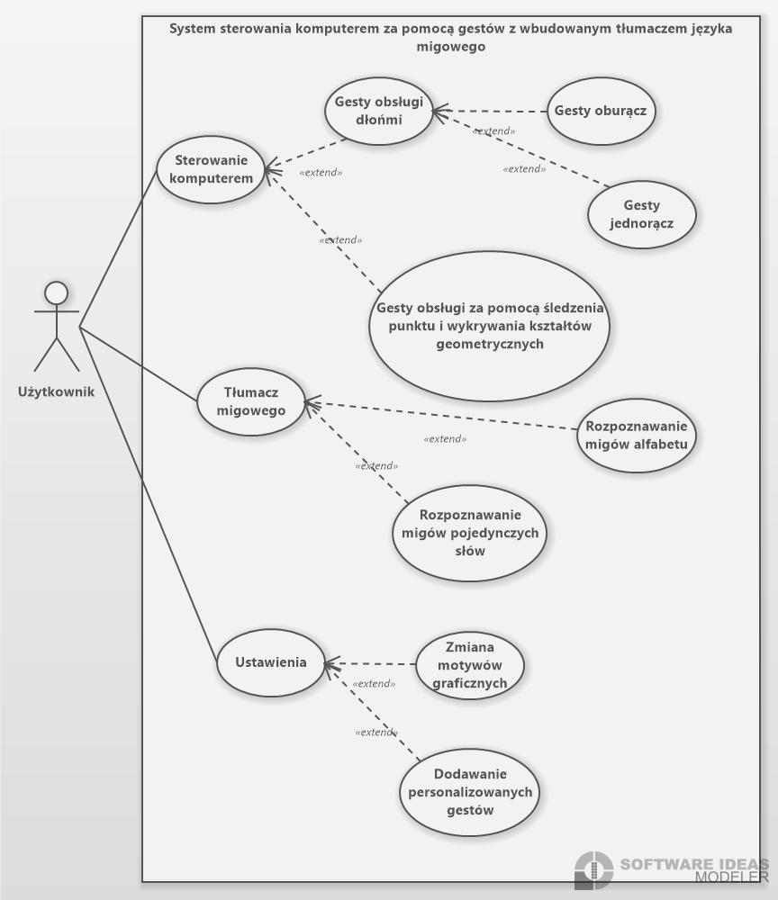

# SystemTouch

[](https://github.com/mitahezyf/SysTouch-pracainz/actions/workflows/ci.yml)
[](https://codecov.io/gh/mitahezyf/SysTouch-pracainz)


Nowoczesne sterowanie komputerem za pomocą gestów dłoni wykrywanych w kamerze. Projekt działa lokalnie na Windows i wykorzystuje MediaPipe oraz OpenCV do detekcji dłoni, a następnie mapuje rozpoznane gesty na akcje systemowe.

- Dokumentacja pipeline: docs/GESTURE_PIPELINE.md
- Mapowanie gestów -> akcje i MVP GUI: docs/GESTURE_MAPPING_AND_GUI.md
- Projektowy TODO (checklista, komentarze): docs/PROJECT_TODO.todo
- Diagram przypadków użycia: UseCaseDiagram1.png

## Wymagania
- System: Windows 10/11
- Python: 3.12
- Kamera: min. 720p, 30 FPS

## Zależności
Główne biblioteki używane przez projekt:
- mediapipe - śledzenie dłoni/landmarków
- opencv-python (lub opencv-python-headless) - przetwarzanie obrazu i GUI (imshow)
- numpy - operacje numeryczne
- pywin32 / comtypes / pycaw - kontrola głośności systemu
- PyAutoGUI / pynput - sterowanie myszą/klawiaturą
- pytest - testy jednostkowe

Zobacz plik `requirements.txt` dla pełnej listy i wersji. Jeśli nie potrzebujesz okna podglądu (GUI), możesz użyć wariantu `opencv-python-headless`.

## Nowe: GUI (PySide6)
Dostępne jest lekkie, eleganckie GUI oparte o PySide6 (Qt), które wykorzystuje istniejący pipeline (MediaPipe + OpenCV) i pozwala sterować działaniem aplikacji.

Funkcje MVP:
- Wybór kamery (automatyczne wykrywanie dostępnych urządzeń)
- Start/Stop przetwarzania
- Przełącznik „Wykonuj akcje” (bezpiecznie domyślnie wyłączony)
- Przełącznik „Pokaż podgląd” (możliwość ukrycia okna wideo)
- Wyświetlanie bieżącego gestu, FPS oraz FrameTime

Instalacja (GUI):
1) Zainstaluj zależności developerskie (zawierają PySide6):

```
python -m pip install -r requirements-dev.txt
```

2) Uruchom GUI:

```
python -m app.gui.ui_app
```

Uwagi:
- GUI działa lokalnie na Windows i wykorzystuje kamerę systemową.
- „Wykonuj akcje” wywołuje zmapowane akcje systemowe (klik, scroll, głośność) – zostaw wyłączone podczas pierwszych testów.
- Jeśli korzystasz z `opencv-python-headless`, do GUI potrzebny jest pełny `opencv-python`.

## Szybki start (CLI)
Punkt wejścia: `app/main.py`.
- Uruchom: `python -m app.main` (z katalogu głównego repo) lub `python app/main.py`.
- Wyjście: naciśnij ESC w oknie podglądu.

Domyślnie program otwiera okno podglądu (GUI). Jeśli środowisko nie wspiera OpenCV HighGUI, aplikacja sama przełączy się w tryb headless. Możesz też wyłączyć GUI ręcznie (`SHOW_WINDOW = False` w `app/gesture_engine/config.py`).

## Konfiguracja
Plik: `app/gesture_engine/config.py`. Kluczowe opcje:
- Kamera i obraz:
  - `CAMERA_INDEX` - indeks kamery (0 domyślnie)
  - `CAPTURE_WIDTH`, `CAPTURE_HEIGHT` - rozdzielczość przechwytywania (np. 1920x1080)
  - `DISPLAY_WIDTH`, `DISPLAY_HEIGHT` - rozdzielczość wyświetlania (np. 640x480)
  - `TARGET_CAMERA_FPS` - docelowa liczba FPS
  - `SHOW_WINDOW` - włącza/wyłącza okno podglądu
- Logowanie i overlay: `LOG_LEVEL`, `DEBUG_MODE`, `SHOW_FPS`, `SHOW_DELAY`
- Progi gestów: `CLICK_THRESHOLD`, `SCROLL_THRESHOLD`, `VOLUME_THRESHOLD`, `GESTURE_CONFIDENCE_THRESHOLD`, itp.
- Gesty z JSON (opcjonalnie): `USE_JSON_GESTURES`, `JSON_GESTURE_PATHS`

## Gesty i akcje (zaimplementowane)
Mapowanie (zob. `app/gesture_engine/core/handlers.py`):
- `click` - symulacja kliknięcia
- `move_mouse` - poruszanie kursorem
- `scroll` - przewijanie
- `volume` - regulacja głośności systemu
- `close_program` - zamykanie aktywnego okna/programu

Detekcja landmarków: `app/gesture_engine/detector/hand_tracker.py`
Prosty klasyfikator gestów: `app/gesture_engine/detector/gesture_detector.py`
Wizualizacja (landmarki, FPS): `app/gesture_engine/utils/visualizer.py`
Przechwytywanie wątkiem: `app/gesture_engine/utils/video_capture.py`

## Testy
Uruchom w katalogu głównym:
- `python -m pytest -q`

Raporty coverage generowane są w CI do `reports/coverage.xml`.

## Kontrole lokalne (Windows cmd.exe)
- Lint: `ruff check .`
- Typy: `mypy .`

## CI/CD
- CI (`.github/workflows/ci.yml`): Windows, Python 3.12, testy z pokryciem (pytest-cov), artefakty JUnit i coverage, publikacja do Codecov (repo publiczne - bez tokena lub z CODECOV_TOKEN).
- CodeQL (`.github/workflows/codeql.yml`): analiza bezpieczeństwa na push/PR (bez harmonogramu tygodniowego).

Badge’e u góry wskazują status CI i wykres pokrycia gałęzi `main`.

## Struktura repo (skrót)
- `app/` - kod aplikacji
  - `main.py` - punkt wejścia (CLI / OpenCV imshow)
  - `gui/ui_app.py` - punkt wejścia GUI (PySide6)
  - `gesture_engine/` - silnik gestów (detekcja, klasyfikacja, akcje, utils, konfiguracja)
- `tests/` - testy jednostkowe
- `docs/GESTURE_PIPELINE.md` - pipeline przetwarzania gestów
- `UseCaseDiagram1.png` - diagram przypadków użycia

---

## Specyfikacja i przypadki użycia

### Wymagania sprzętowe
- Kamerka minimum 30 FPS o rozdzielczości minimum 720p

### Opis funkcjonalności
- Sterowanie komputerem za pomocą predefiniowanych gestów
- Rozpoznawanie alfabetu oraz podstawowych słów w języku migowym
- Możliwość definiowania własnych gestów
- Zmiana motywów graficznych oraz widoczności programu/nakładki podczas korzystania z komputera
- Prowadzenie statystyk częstotliwości występowania poszczególnych gestów

### Aktorzy
Jedyny aktor przewidziany jest dla użytkownika; program działa lokalnie, więc nie potrzeba roli administracyjnej.

### Przykładowe gesty
- lupa - oddalenie od siebie kciuka i palca wskazującego
- przewijanie w dół - przesunięcie ręki i gest "idź sobie"
- zmiana głośności - przytrzymanie złączonego kciuka i palca serdecznego, następnie przeliczanie ich odległości na skalę głośności
- klik - złączone palce i gest puknięcia
- powrót - machnięcie dłoni w lewo

### Interakcja z programem
Program w czasie rzeczywistym reaguje na gesty i wykonuje przypisane do nich akcje. Po wykonaniu specjalnego gestu przełączany jest tryb obsługi gestów oraz rozpoznawania języka migowego. W trybie uproszczonym program śledzi położenie specjalnie przeznaczonego do tego przedmiotu i rozpoznaje kształty/gesty.

### Diagram przypadków użycia



### Przypadki użycia
| Nazwa:                          | Sterowanie komputerem |
|---------------------------------|------------------------|
| Aktorzy:                        | Użytkownik |
| Krótki opis:                    | Sterowanie komputerem przy pomocy gestów wykonywanych jedną lub obiema rękami oraz gestów rozpoznawanych przez analizę kształtów geometrycznych. |
| Warunki wstępne:                | Użytkownik musi mieć skonfigurowane urządzenie do rejestrowania gestów (np. kamera) oraz aktywny system rozpoznawania gestów. |
| Warunki końcowe:                | System poprawnie interpretuje gesty użytkownika jako polecenia i wykonuje odpowiadające im akcje w systemie operacyjnym. |
| Główny przepływ zdarzeń:        | 1. Użytkownik inicjuje sesję sterowania gestami. <br/>2. System uruchamia moduł rozpoznawania gestów. <br/>3. Użytkownik wykonuje gesty jednoręczne lub oburęczne. <br/>4. System rozpoznaje gest jako jedno z dostępnych poleceń (np. kliknięcie, przewijanie). <br/>5. Użytkownik wykonuje gest geometryczny (np. koło, linia). <br/>6. System interpretuje kształt i wykonuje przypisaną akcję. <br/>7. System informuje użytkownika o wykonaniu akcji (np. dźwiękiem lub ikoną). |
| Alternatywne przepływy zdarzeń: | 3a. System nie rozpoznaje gestu: wyświetlana jest informacja o błędzie i użytkownik może spróbować ponownie. <br/>4a. Gest jest nieprawidłowy lub niewłaściwie wykonany - brak akcji, system prosi o powtórzenie. |
| Specjalne wymagania:            | 1. Rozpoznanie gestu nie może trwać dłużej niż 1 sekundę.<br/> 2. System powinien działać w czasie rzeczywistym z opóźnieniem nie większym niż 0.5 sekundy od wykonania gestu do reakcji.<br/> 3. Minimalne oświetlenie 150 luksów. |

| Nazwa:                          | Gesty obsługi dłoni |
|---------------------------------|----------------------|
| Aktorzy:                        | Użytkownik |
| Krótki opis:                    | Umożliwienie użytkownikowi wykonywania poleceń za pomocą gestów jednej lub dwóch dłoni. |
| Warunki wstępne:                | System musi mieć uruchomione rozpoznawanie gestów i dostęp do kamery. |
| Warunki końcowe:                | Gesty są poprawnie zinterpretowane i wywołują odpowiednie akcje. |
| Główny przepływ zdarzeń:        | 1. Użytkownik wykonuje gest dłonią.<br/>2. System analizuje układ i ruch dłoni.<br/>3. Gest zostaje zaklasyfikowany jako jedno- lub oburęczny.<br/>4. System wykonuje odpowiednią akcję. |
| Alternatywne przepływy zdarzeń: | 2a. Ręka niewidoczna - system zgłasza brak widoczności dłoni.<br/>3a. Niezidentyfikowany gest - użytkownik proszony o powtórzenie. |
| Specjalne wymagania:            | 1. Minimalna rozdzielczość kamery: 720p.<br/>2. Opóźnienie maksymalne: 0.3 sekundy. |

| Nazwa:                          | Gesty oburącz |
|---------------------------------|---------------|
| Aktorzy:                        | Użytkownik |
| Krótki opis:                    | Rozpoznawanie i interpretacja gestów wykonywanych obiema rękami. |
| Warunki wstępne:                | Obie ręce muszą być widoczne dla systemu. |
| Warunki końcowe:                | System poprawnie wykonuje przypisaną akcję do gestu oburęcznego. |
| Główny przepływ zdarzeń:        | 1. Użytkownik unosi obie ręce i wykonuje gest.<br/>2. System rozpoznaje układ dłoni oraz synchronizację ruchów.<br/>3. Wykonywana jest przypisana operacja systemowa. |
| Alternatywne przepływy zdarzeń: | 1a. Jedna ręka niewidoczna - system prosi o poprawne wykonanie gestu. |
| Specjalne wymagania:            | 1. Wymagana synchronizacja rąk z dokładnością do 0.2 sekundy. |

| Nazwa:                          | Gesty jednorącz |
|---------------------------------|-----------------|
| Aktorzy:                        | Użytkownik |
| Krótki opis:                    | Wykonywanie akcji za pomocą gestów jednej dłoni. |
| Warunki wstępne:                | Widoczność jednej dłoni w kadrze. |
| Warunki końcowe:                | System wykonuje przypisaną operację. |
| Główny przepływ zdarzeń:        | 1. Użytkownik wykonuje gest jednoręczny.<br/>2. System analizuje jego kształt, kierunek i dynamikę.<br/>3. Rozpoznany gest powoduje określoną akcję. |
| Alternatywne przepływy zdarzeń: | 2a. Niezrozumiały gest - prośba o powtórzenie. |
| Specjalne wymagania:            | Ręka nie może być zasłonięta ani rozmyta. |

| Nazwa:                          | Gesty obsługi za pomocą śledzenia punktu i wykrywania kształtów geometrycznych |
|---------------------------------|----------------------------------------------------------------------------------|
| Aktorzy:                        | Użytkownik |
| Krótki opis:                    | Rozpoznawanie gestów przez śledzenie ruchu punktu (np. palca) i kształtów (np. koła, trójkąta). |
| Warunki wstępne:                | Aktywny tryb śledzenia punktów. |
| Warunki końcowe:                | Zidentyfikowany kształt powoduje wykonanie akcji. |
| Główny przepływ zdarzeń:        | 1. Użytkownik wykonuje rysunek w powietrzu (np. okrąg).<br/>2. System śledzi trajektorię ruchu.<br/>3. Kształt zostaje rozpoznany i zinterpretowany jako polecenie.<br/>4. Wykonywana jest akcja. |
| Alternatywne przepływy zdarzeń: | 2a. Kształt zbyt nieczytelny - komunikat błędu. |
| Specjalne wymagania:            | Dopuszczalna tolerancja rozpoznania kształtu: ±10%. |

| Nazwa:                          | Tłumacz migowego |
|---------------------------------|------------------|
| Aktorzy:                        | Użytkownik |
| Krótki opis:                    | Moduł tłumaczący gesty języka migowego na tekst lub mowę. |
| Warunki wstępne:                | Włączony tryb tłumacza migowego. |
| Warunki końcowe:                | Gesty przetłumaczone na tekst lub komunikaty dźwiękowe. |
| Główny przepływ zdarzeń:        | 1. Użytkownik wykonuje gest w języku migowym.<br/>2. System analizuje i identyfikuje gest.<br/>3. Odpowiedni tekst zostaje wyświetlony lub wypowiedziany. |
| Alternatywne przepływy zdarzeń: | 2a. Brak rozpoznania gestu - użytkownik informowany o błędzie. |
| Specjalne wymagania:            | Obsługa co najmniej 500 najczęściej używanych gestów. |

| Nazwa:                          | Rozpoznawanie migów pojedynczych słów |
|---------------------------------|--------------------------------------|
| Aktorzy:                        | Użytkownik |
| Krótki opis:                    | Tłumaczenie pojedynczych gestów na konkretne słowa. |
| Warunki wstępne:                | Tryb tłumaczenia migów aktywny. |
| Warunki końcowe:                | Każdy gest zostaje przypisany do słowa. |
| Główny przepływ zdarzeń:        | 1. Użytkownik wykonuje gest odpowiadający konkretnemu słowu.<br/>2. System wyświetla tłumaczenie na ekranie. |
| Alternatywne przepływy zdarzeń: | 1a. Gest nieznany - komunikat błędu. |
| Specjalne wymagania:            | Słownik co najmniej 300 słów. |

| Nazwa:                          | Rozpoznawanie migów alfabetu |
|---------------------------------|-------------------------------|
| Aktorzy:                        | Użytkownik |
| Krótki opis:                    | System rozpoznaje litery alfabetu migowego. |
| Warunki wstępne:                | Aktywny tryb alfabetu. |
| Warunki końcowe:                | System wyświetla literę odpowiadającą gestowi. |
| Główny przepływ zdarzeń:        | 1. Użytkownik pokazuje literę w języku migowym.<br/>2. System rozpoznaje ją i dodaje do tekstu. |
| Alternatywne przepływy zdarzeń: | 1a. Nierozpoznana litera - informacja zwrotna o błędzie. |
| Specjalne wymagania:            | Obsługa pełnego alfabetu (26 liter). |

| Nazwa:                          | Ustawienia |
|---------------------------------|-----------|
| Aktorzy:                        | Użytkownik |
| Krótki opis:                    | Dostęp do konfiguracji i personalizacji systemu. |
| Warunki wstępne:                | Użytkownik uruchamia panel ustawień. |
| Warunki końcowe:                | Zmiany są zapisane i aktywne. |
| Główny przepływ zdarzeń:        | 1. Użytkownik otwiera ustawienia.<br/>2. Przegląda dostępne opcje konfiguracji.<br/>3. Dokonuje zmian. |
| Specjalne wymagania:            | Panel musi być dostępny w każdej chwili. |

| Nazwa:                          | Zmiana motywów graficznych |
|---------------------------------|----------------------------|
| Aktorzy:                        | Użytkownik |
| Krótki opis:                    | Zmiana wyglądu interfejsu użytkownika. |
| Warunki wstępne:                | Użytkownik musi mieć dostęp do ustawień. |
| Warunki końcowe:                | Motyw zostaje zmieniony i zapisany. |
| Główny przepływ zdarzeń:        | 1. Użytkownik wchodzi do sekcji „Motywy”.<br/>2. Wybiera preferowany motyw.<br/>3. System natychmiast stosuje nowy wygląd. |
| Specjalne wymagania:            | Obsługa przynajmniej motywu jasnego i ciemnego. |

| Nazwa:                          | Dodawanie personalizowanych gestów |
|---------------------------------|-----------------------------------|
| Aktorzy:                        | Użytkownik |
| Krótki opis:                    | Użytkownik może definiować własne gesty i przypisywać im funkcje. |
| Warunki wstępne:                | Aktywny panel personalizacji. |
| Warunki końcowe:                | Nowy gest jest rozpoznawany przez system i aktywny. |
| Główny przepływ zdarzeń:        | 1. Użytkownik otwiera panel dodawania gestu.<br/>2. Wykonuje gest próbny.<br/>3. Przypisuje mu określoną funkcję.<br/>4. Zapisuje konfigurację. |
| Alternatywne przepływy zdarzeń: | 2a. Gest zbyt podobny do istniejącego - system prosi o inny. |
| Specjalne wymagania:            | Możliwość zapisania co najmniej 20 gestów użytkownika. |

